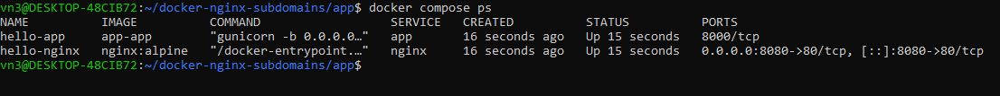
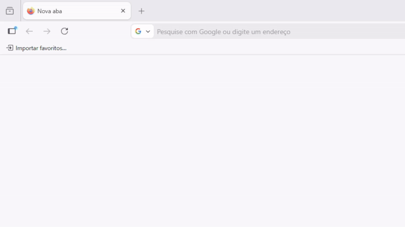

# PT-BR

O objetivo desse projeto é aprender os conceitos fundamentais de multi-tenancy. Utilizei Docker, Nginx e Flask para identificar tenants por subdomínio e headers HTTP. Também foi usado Gunicorn para intermediar o Nginx e a aplicação.

Quando o cliente digita um dominio no navegador:

`cliente1.localhost`  
`cliente2.localhost`
- A requisição chega no **Nginx**, que encaminha para o app Python.
- Informações como host e headers customizados são preservadas.
- A aplicação interpreta e retorna:
    - Saudação com o nome,
    - Cliente, 
    - Background color diferente por tenant.

Tudo isso rodando em containers **Docker** de forma isolada.

```bash
docker compose ps
```



# EN-US

The objective of this project is to learn the fundamental concepts of multi-tenancy. I used Docker, Nginx, and Flask to identify tenants through subdomains and HTTP headers. It was also used Gunicorn to mediate between Nginx and the application.

When the client types a domain in the browser:

`client1.localhost`  
`client2.localhost`
- The request reaches **Nginx**, which forwards it to the Python app.
- Information such as host and custom headers is preserved.
- The application interprets and returns:
    - Greeting with the name,
    - Client,
    - Different background color per tenant.

All of this runs in isolated **Docker** containers.

```bash
docker compose ps
```


